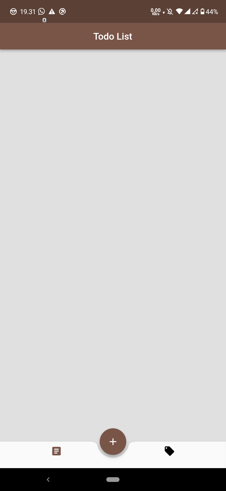
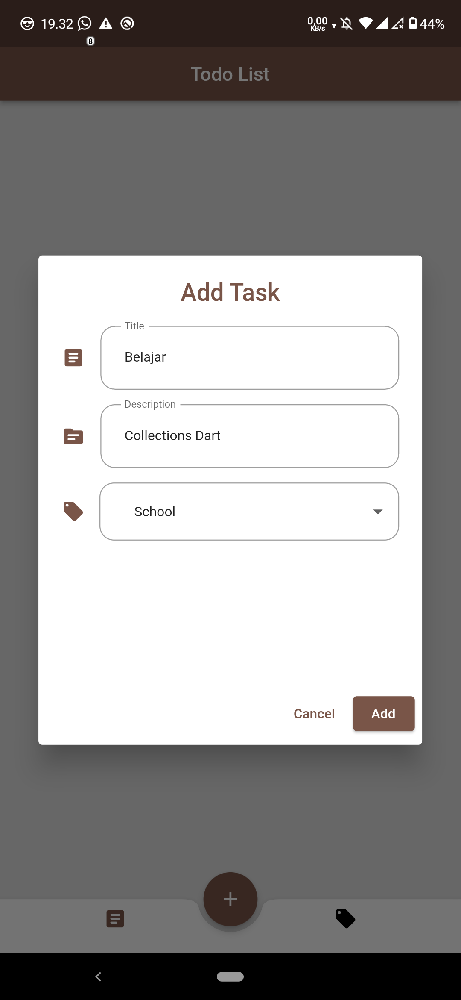
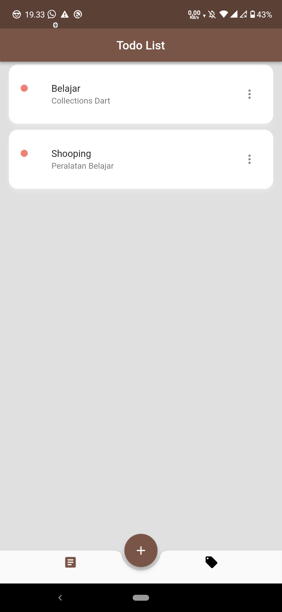
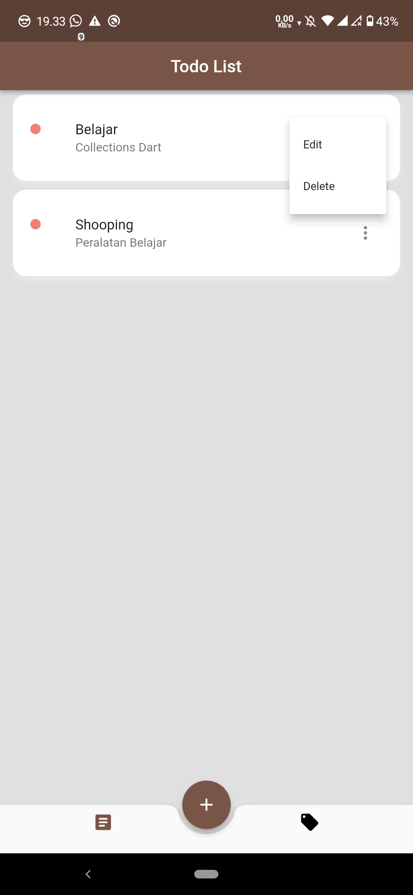
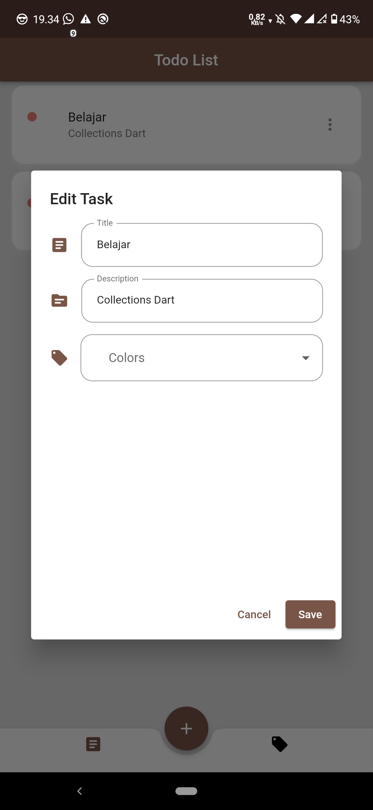
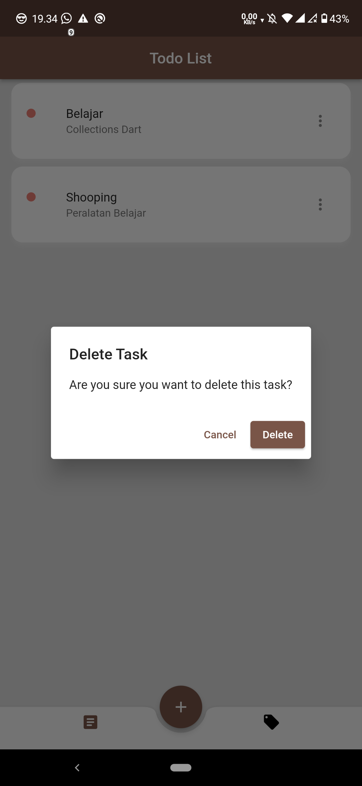

# Todo Kita

Aplikasi Todo List untuk mempermudah pekerjaan.

1. run "Flutter pub get"

##Project Structure

- lib
  - database
    - database_helper.dart
  - model
    - constants.dart
    - task_model.dart
  - ui
    - categories.dart
    - todo_list_screen.dart
  - widget
    - task_card.dart
  - main.dart

## Screenshot

   
  

   
  

   
  

